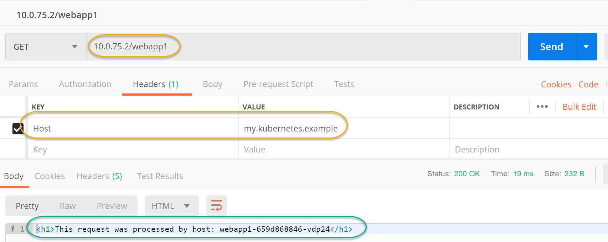

### Ingress with (Manually Setup nginx Controller)

1.  This demo has THREE files, the first [deployment.yml](./deployment.yml) contains THREE webapps with `cluster-Ip` services.

    ```bash
    $ kubectl apply -f deployment.yml
    $ kubectl get deploy
    $ kubectl get svc
    $ kubectl get rs
    ```

2.  The second file is an `ingress-controller`, this controller has multiple components like `serviceaccount`, a `token` for authentication and authorization, and then service type `NodePort` to bind `nginx-controller` service to all nodes.

    ```bash
    $ kubectl apply -f ingress-controller.yml
    ### the entire nginx-controller application is deployed inside 
    ### a seperate namespace of it's own!!!
    $ kubectl get all -n nginx-ingress
    ```

3.  Now, just need to deploy `ingress-rules`. The only available `ingress-controller` would pick those rules and implement them!

    ```bash
    $ kubectl apply -f ingress-rules.yaml
    $ kubectl describe -f ingress-rules.yaml
    #### Expect to get name of nginx-ingress-controller in log output.
    ```

4.  Now, to test the webapp, you can use `curl` or `postman`

    4.1 Using `curl`

    ```bash
    $ curl -H "my.kubernetes.example" 10.0.75.2/webapp1
    $ curl -H "my.kubernetes.example" 10.0.75.2/webapp2
    ```

    NOTE: the ip address `10.0.75.2` belogs to your hyper-v VM

    4.2 Using `Postman`

    

    